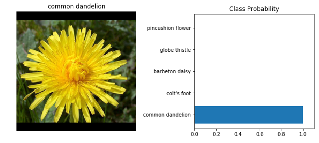


# Developing an AI application

Going forward, AI algorithms will be incorporated into more and more everyday applications. For example, you might want to include an image classifier in a smart phone app. To do this, you'd use a deep learning model trained on hundreds of thousands of images as part of the overall application architecture. A large part of software development in the future will be using these types of models as common parts of applications. 

In this project, trained an image classifier to recognize different species of flowers. We'll be using [this dataset](http://www.robots.ox.ac.uk/~vgg/data/flowers/102/index.html) of 102 flower categories, you can see a few examples below. 


The project is broken down into multiple steps:

* Load and preprocess the image dataset
* Train the image classifier on your dataset
* Use the trained classifier to predict image content

First up is importing the packages we need. 


```python
# Imports here

%matplotlib inline
%config InlineBackEnd.figure_format = 'retina'

import matplotlib.pyplot as plt
import numpy as np
import json

from PIL import Image
from collections import OrderedDict

import torch
import torch.nn.functional as F
from torch import nn
from torch import optim
from torchvision import datasets, transforms, models
```

## Load the data

Here `torchvision` will be used to load the data ([documentation](http://pytorch.org/docs/0.3.0/torchvision/index.html)). The data should be included alongside this notebook, otherwise you can [download it here](https://s3.amazonaws.com/content.udacity-data.com/nd089/flower_data.tar.gz). The dataset is split into three parts, training, validation, and testing. For the training, you'll want to apply transformations such as random scaling, cropping, and flipping. This will help the network generalize leading to better performance. You'll also need to make sure the input data is resized to 224x224 pixels as required by the pre-trained networks.

The validation and testing sets are used to measure the model's performance on data it hasn't seen yet. For this you don't want any scaling or rotation transformations, but you'll need to resize then crop the images to the appropriate size.

The pre-trained networks you'll use were trained on the ImageNet dataset where each color channel was normalized separately. For all three sets you'll need to normalize the means and standard deviations of the images to what the network expects. For the means, it's `[0.485, 0.456, 0.406]` and for the standard deviations `[0.229, 0.224, 0.225]`, calculated from the ImageNet images.  These values will shift each color channel to be centered at 0 and range from -1 to 1.
 


```python
data_dir = 'flowers'
train_dir = data_dir + '/train'
valid_dir = data_dir + '/valid'
test_dir = data_dir + '/test'
```


```python
# Transforms for the training, validation, and testing sets
normalize = transforms.Normalize([0.485, 0.456, 0.406], [0.229, 0.224, 0.225])

data_transforms = {'train_transforms': transforms.Compose([transforms.RandomResizedCrop(224),
                                                           transforms.RandomHorizontalFlip(),
                                                           transforms.RandomVerticalFlip(),
                                                           transforms.ToTensor(),
                                                           normalize
                                                         ]),
                   'valid_transforms': transforms.Compose([transforms.Resize(256),
                                                           transforms.CenterCrop(224),
                                                           transforms.ToTensor(),
                                                           normalize
                                                         ]),
                   'test_transforms' : transforms.Compose([transforms.Resize(256),
                                                           transforms.CenterCrop(224),
                                                           transforms.ToTensor(),
                                                           normalize
                                                          ])               
                  }

# Load the datasets with ImageFolder
image_datasets = {'train_dataset': datasets.ImageFolder(train_dir, transform=data_transforms['train_transforms']),
                  'valid_dataset': datasets.ImageFolder(valid_dir, transform=data_transforms['valid_transforms']),
                  'test_dataset' : datasets.ImageFolder(test_dir, transform=data_transforms['test_transforms'])
                 } 

# Define the dataloaders
dataloaders = {'train_loader': torch.utils.data.DataLoader(image_datasets['train_dataset'], batch_size=64, shuffle=True),
               'valid_loader': torch.utils.data.DataLoader(image_datasets['valid_dataset'], batch_size=64, shuffle=False),
               'test_loader' : torch.utils.data.DataLoader(image_datasets['test_dataset'], batch_size=64, shuffle=False)
              }
```

### Label mapping

You'll also need to load in a mapping from category label to category name. You can find this in the file `cat_to_name.json`. It's a JSON object which you can read in with the [`json` module](https://docs.python.org/2/library/json.html). This will give you a dictionary mapping the integer encoded categories to the actual names of the flowers.


```python
with open('cat_to_name.json', 'r') as f:
    cat_to_name = json.load(f)
```

# Building and training the classifier

Now that the data is ready, it's time to build and train the classifier. As usual, you should use one of the pretrained models from `torchvision.models` to get the image features. Build and train a new feed-forward classifier using those features.

We're going to leave this part up to you. If you want to talk through it with someone, chat with your fellow students! You can also ask questions on the forums or join the instructors in office hours.

Refer to [the rubric](https://review.udacity.com/#!/rubrics/1663/view) for guidance on successfully completing this section. Things you'll need to do:

* Load a [pre-trained network](http://pytorch.org/docs/master/torchvision/models.html) (If you need a starting point, the VGG networks work great and are straightforward to use)
* Define a new, untrained feed-forward network as a classifier, using ReLU activations and dropout
* Train the classifier layers using backpropagation using the pre-trained network to get the features
* Track the loss and accuracy on the validation set to determine the best hyperparameters

We've left a cell open for you below, but use as many as you need. Our advice is to break the problem up into smaller parts you can run separately. Check that each part is doing what you expect, then move on to the next. You'll likely find that as you work through each part, you'll need to go back and modify your previous code. This is totally normal!

When training make sure you're updating only the weights of the feed-forward network. You should be able to get the validation accuracy above 70% if you build everything right. Make sure to try different hyperparameters (learning rate, units in the classifier, epochs, etc) to find the best model. Save those hyperparameters to use as default values in the next part of the project.


```python
# Build and train network
model = models.vgg16(pretrained=True)
```

    Downloading: "https://download.pytorch.org/models/vgg16-397923af.pth" to /root/.torch/models/vgg16-397923af.pth
    100%|██████████| 553433881/553433881 [00:26<00:00, 21015474.40it/s]
    


```python
# Freeze parameters and define a new feedforward network for use as a classifier using the features as input
for param in model.parameters():
    param.requires_grad = False
    
classifier = nn.Sequential(OrderedDict([
                          ('fc1', nn.Linear(25088, 4096)),
                          ('relu1', nn.ReLU()),
                          ('drop1', nn.Dropout(p=0.5)),
                          ('fc2', nn.Linear(4096, 2000)),
                          ('relu2', nn.ReLU()),
                          ('drop2', nn.Dropout(p=0.5)),
                          ('fc3', nn.Linear(2000, 102)),
                          ('output', nn.LogSoftmax(dim=1))    
                    ]))
model.classifier = classifier
```


```python
# Avoid overfitting when training the network with using validation method
def validation(model, validloader, criterion):
    valid_loss = 0
    accuracy = 0
    for images, labels in validloader:
        images, labels = images.cuda(), labels.cuda()
        output = model.forward(images)
        valid_loss += criterion(output, labels).item()
        
        ps = torch.exp(output)
        equality = (labels.data == ps.max(dim=1)[1]) 
        accuracy += equality.type(torch.FloatTensor).mean()
    return valid_loss, accuracy
```


```python
#Train a model with a pre-trained network
def train(model, epochs, lr=0.001):

    #Check GPU is active
    if torch.cuda.is_available():
        print('GPU will be used for training.\n')
        device = torch.device('cuda:0')
        model.cuda()
    else:
        print('CPU will be used for training.\n')
        device = torch.device('cpu')

    criterion = nn.NLLLoss()
    optimizer = optim.Adam(model.classifier.parameters(), lr=lr)

    epochs = epochs
    print_every = 40
    steps = 0
    running_loss = 0

    for e in range(epochs):
        model.train()
        for images, labels in dataloaders['train_loader']:
            steps += 1
            
            images, labels = images.to(device), labels.to(device)

            optimizer.zero_grad()

            outputs = model.forward(images)
            loss = criterion(outputs, labels)
            loss.backward()
            optimizer.step()

            running_loss += loss.item()

            if steps % print_every == 0:
                model.eval()
                
                with torch.no_grad():
                    valid_loss, accuracy = validation(model, dataloaders['valid_loader'], criterion)
                    
                print(" Epoch: {}/{}\n".format(e+1, epochs),
                      "Training Loss: {:.3f}\n".format(running_loss/print_every),
                      "Validation Loss: {:.3f}\n".format(valid_loss/len(dataloaders['valid_loader'])),
                      "Accuracy: {:.2f}%\n".format(100 * (accuracy/len(dataloaders['valid_loader']))),
                      "*********************************\n")
                running_loss = 0
                model.train()
```


```python
train(model, epochs=20)
```

    GPU will be used for training.
    
     Epoch: 1/20
     Training Loss: 4.402
     Validation Loss: 2.947
     Accuracy: 32.60%
     *********************************
    
     Epoch: 1/20
     Training Loss: 2.882
     Validation Loss: 1.666
     Accuracy: 57.83%
     *********************************
    
     Epoch: 2/20
     Training Loss: 2.314
     Validation Loss: 1.339
     Accuracy: 63.82%
     *********************************
    
     Epoch: 2/20
     Training Loss: 2.102
     Validation Loss: 1.131
     Accuracy: 70.43%
     *********************************
    
     Epoch: 2/20
     Training Loss: 2.077
     Validation Loss: 1.115
     Accuracy: 69.91%
     *********************************
    
     Epoch: 3/20
     Training Loss: 1.922
     Validation Loss: 0.965
     Accuracy: 73.10%
     *********************************
    
     Epoch: 3/20
     Training Loss: 1.863
     Validation Loss: 0.894
     Accuracy: 74.26%
     *********************************
    
     Epoch: 4/20
     Training Loss: 1.859
     Validation Loss: 0.857
     Accuracy: 75.30%
     *********************************
    
     Epoch: 4/20
     Training Loss: 1.802
     Validation Loss: 0.786
     Accuracy: 79.90%
     *********************************
    
     Epoch: 4/20
     Training Loss: 1.702
     Validation Loss: 0.815
     Accuracy: 79.76%
     *********************************
    
     Epoch: 5/20
     Training Loss: 1.768
     Validation Loss: 0.793
     Accuracy: 78.80%
     *********************************
    
     Epoch: 5/20
     Training Loss: 1.777
     Validation Loss: 0.742
     Accuracy: 79.83%
     *********************************
    
     Epoch: 6/20
     Training Loss: 1.765
     Validation Loss: 0.887
     Accuracy: 78.50%
     *********************************
    
     Epoch: 6/20
     Training Loss: 1.679
     Validation Loss: 0.756
     Accuracy: 81.21%
     *********************************
    
     Epoch: 6/20
     Training Loss: 1.625
     Validation Loss: 0.708
     Accuracy: 83.28%
     *********************************
    
     Epoch: 7/20
     Training Loss: 1.646
     Validation Loss: 0.687
     Accuracy: 82.10%
     *********************************
    
     Epoch: 7/20
     Training Loss: 1.606
     Validation Loss: 0.736
     Accuracy: 79.56%
     *********************************
    
     Epoch: 7/20
     Training Loss: 1.630
     Validation Loss: 0.717
     Accuracy: 82.05%
     *********************************
    
     Epoch: 8/20
     Training Loss: 1.547
     Validation Loss: 0.653
     Accuracy: 83.80%
     *********************************
    
     Epoch: 8/20
     Training Loss: 1.687
     Validation Loss: 0.739
     Accuracy: 81.57%
     *********************************
    
     Epoch: 9/20
     Training Loss: 1.540
     Validation Loss: 0.677
     Accuracy: 81.32%
     *********************************
    
     Epoch: 9/20
     Training Loss: 1.448
     Validation Loss: 0.634
     Accuracy: 84.37%
     *********************************
    
     Epoch: 9/20
     Training Loss: 1.567
     Validation Loss: 0.707
     Accuracy: 81.89%
     *********************************
    
     Epoch: 10/20
     Training Loss: 1.581
     Validation Loss: 0.662
     Accuracy: 84.55%
     *********************************
    
     Epoch: 10/20
     Training Loss: 1.556
     Validation Loss: 0.686
     Accuracy: 83.76%
     *********************************
    
     Epoch: 11/20
     Training Loss: 1.637
     Validation Loss: 0.706
     Accuracy: 82.82%
     *********************************
    
     Epoch: 11/20
     Training Loss: 1.560
     Validation Loss: 0.668
     Accuracy: 83.62%
     *********************************
    
     Epoch: 11/20
     Training Loss: 1.560
     Validation Loss: 0.701
     Accuracy: 82.03%
     *********************************
    
     Epoch: 12/20
     Training Loss: 1.540
     Validation Loss: 0.661
     Accuracy: 83.56%
     *********************************
    
     Epoch: 12/20
     Training Loss: 1.691
     Validation Loss: 0.646
     Accuracy: 84.45%
     *********************************
    
     Epoch: 13/20
     Training Loss: 1.488
     Validation Loss: 0.652
     Accuracy: 83.81%
     *********************************
    
     Epoch: 13/20
     Training Loss: 1.514
     Validation Loss: 0.586
     Accuracy: 86.49%
     *********************************
    
     Epoch: 13/20
     Training Loss: 1.465
     Validation Loss: 0.610
     Accuracy: 86.25%
     *********************************
    
     Epoch: 14/20
     Training Loss: 1.634
     Validation Loss: 0.656
     Accuracy: 86.46%
     *********************************
    
     Epoch: 14/20
     Training Loss: 1.537
     Validation Loss: 0.620
     Accuracy: 85.88%
     *********************************
    
     Epoch: 14/20
     Training Loss: 1.631
     Validation Loss: 0.597
     Accuracy: 85.74%
     *********************************
    
     Epoch: 15/20
     Training Loss: 1.470
     Validation Loss: 0.607
     Accuracy: 86.82%
     *********************************
    
     Epoch: 15/20
     Training Loss: 1.543
     Validation Loss: 0.643
     Accuracy: 85.92%
     *********************************
    
     Epoch: 16/20
     Training Loss: 1.500
     Validation Loss: 0.587
     Accuracy: 87.28%
     *********************************
    
     Epoch: 16/20
     Training Loss: 1.518
     Validation Loss: 0.569
     Accuracy: 87.33%
     *********************************
    
     Epoch: 16/20
     Training Loss: 1.452
     Validation Loss: 0.624
     Accuracy: 86.22%
     *********************************
    
     Epoch: 17/20
     Training Loss: 1.480
     Validation Loss: 0.625
     Accuracy: 85.74%
     *********************************
    
     Epoch: 17/20
     Training Loss: 1.438
     Validation Loss: 0.590
     Accuracy: 86.94%
     *********************************
    
     Epoch: 18/20
     Training Loss: 1.481
     Validation Loss: 0.611
     Accuracy: 86.82%
     *********************************
    
     Epoch: 18/20
     Training Loss: 1.514
     Validation Loss: 0.602
     Accuracy: 87.20%
     *********************************
    
     Epoch: 18/20
     Training Loss: 1.452
     Validation Loss: 0.623
     Accuracy: 87.33%
     *********************************
    
     Epoch: 19/20
     Training Loss: 1.567
     Validation Loss: 0.639
     Accuracy: 87.35%
     *********************************
    
     Epoch: 19/20
     Training Loss: 1.456
     Validation Loss: 0.551
     Accuracy: 87.62%
     *********************************
    
     Epoch: 20/20
     Training Loss: 1.380
     Validation Loss: 0.561
     Accuracy: 87.57%
     *********************************
    
     Epoch: 20/20
     Training Loss: 1.457
     Validation Loss: 0.607
     Accuracy: 86.49%
     *********************************
    
     Epoch: 20/20
     Training Loss: 1.465
     Validation Loss: 0.580
     Accuracy: 87.07%
     *********************************
    
    

## Testing your network

It's good practice to test your trained network on test data, images the network has never seen either in training or validation. This will give you a good estimate for the model's performance on completely new images. Run the test images through the network and measure the accuracy, the same way you did validation. You should be able to reach around 70% accuracy on the test set if the model has been trained well.


```python
# Validation on the test set
def validation_testset(model, testset):
    accuracy = 0

    model.eval()

    with torch.no_grad():
        for images, labels in testset:
            images, labels = images.cuda(), labels.cuda()
            outputs = model.forward(images)
            ps = torch.exp(outputs)
            equation = (labels.data == ps.max(dim=1)[1])
            accuracy += equation.type(torch.FloatTensor).mean()
    print("Test Accuracy: {:.0f}%".format(100 * (accuracy/len(dataloaders['test_loader']))))
```

## Save the checkpoint

Now that your network is trained, save the model so you can load it later for making predictions. You probably want to save other things such as the mapping of classes to indices which you get from one of the image datasets: `image_datasets['train'].class_to_idx`. You can attach this to the model as an attribute which makes inference easier later on.

```model.class_to_idx = image_datasets['train'].class_to_idx```

Remember that you'll want to completely rebuild the model later so you can use it for inference. Make sure to include any information you need in the checkpoint. If you want to load the model and keep training, you'll want to save the number of epochs as well as the optimizer state, `optimizer.state_dict`. You'll likely want to use this trained model in the next part of the project, so best to save it now.


```python
# Save the checkpoint 
def save_checkpoint(model):
    model.class_to_idx = image_datasets['train_dataset'].class_to_idx

    checkpoint = {'input_size': 25088,
                  'hidden_layers': [each for each in model.classifier],
                  'state_dict': model.state_dict(),
                  'class_to_idx': model.class_to_idx,
                 }

    torch.save(checkpoint, 'checkpoint.pth')
```

## Loading the checkpoint

At this point it's good to write a function that can load a checkpoint and rebuild the model. That way you can come back to this project and keep working on it without having to retrain the network.


```python
# load the checkpoint and rebuild the model
def load_checkpoint(path):
    hidden_layers = []
    checkpoint = torch.load(path)
    input_size = checkpoint['input_size']
    hidden_layer = checkpoint['hidden_layers']
    
    for i in range(len(hidden_layer)):
        try:
            hidden_layers.append(hidden_layer[i].out_features)
        except:
            pass  
    
    classifier = nn.Sequential(OrderedDict([
                          ('fc1', nn.Linear(input_size, hidden_layers[0])),
                          ('relu1', nn.ReLU()),
                          ('drop1', nn.Dropout(p=0.5)),
                          ('fc2', nn.Linear(hidden_layers[0], hidden_layers[1])),
                          ('relu2', nn.ReLU()),
                          ('drop2', nn.Dropout(p=0.5)),
                          ('fc3', nn.Linear(hidden_layers[1], hidden_layers[2])),
                          ('output', nn.LogSoftmax(dim=1))    
                    ]))
    model.classifier = classifier
    model.load_state_dict(checkpoint['state_dict'])
    model.class_to_idx = checkpoint['class_to_idx']
    
    return model
```


```python
model = load_checkpoint('checkpoint.pth')
#Check GPU is active
if torch.cuda.is_available():
    print('GPU enabled.')
    device = torch.device('cuda:0')
    model.cuda()
else:
    print('CPU enabled.')
    device = torch.device('cpu')
print(model)
```

    GPU enabled.
    VGG(
      (features): Sequential(
        (0): Conv2d(3, 64, kernel_size=(3, 3), stride=(1, 1), padding=(1, 1))
        (1): ReLU(inplace)
        (2): Conv2d(64, 64, kernel_size=(3, 3), stride=(1, 1), padding=(1, 1))
        (3): ReLU(inplace)
        (4): MaxPool2d(kernel_size=2, stride=2, padding=0, dilation=1, ceil_mode=False)
        (5): Conv2d(64, 128, kernel_size=(3, 3), stride=(1, 1), padding=(1, 1))
        (6): ReLU(inplace)
        (7): Conv2d(128, 128, kernel_size=(3, 3), stride=(1, 1), padding=(1, 1))
        (8): ReLU(inplace)
        (9): MaxPool2d(kernel_size=2, stride=2, padding=0, dilation=1, ceil_mode=False)
        (10): Conv2d(128, 256, kernel_size=(3, 3), stride=(1, 1), padding=(1, 1))
        (11): ReLU(inplace)
        (12): Conv2d(256, 256, kernel_size=(3, 3), stride=(1, 1), padding=(1, 1))
        (13): ReLU(inplace)
        (14): Conv2d(256, 256, kernel_size=(3, 3), stride=(1, 1), padding=(1, 1))
        (15): ReLU(inplace)
        (16): MaxPool2d(kernel_size=2, stride=2, padding=0, dilation=1, ceil_mode=False)
        (17): Conv2d(256, 512, kernel_size=(3, 3), stride=(1, 1), padding=(1, 1))
        (18): ReLU(inplace)
        (19): Conv2d(512, 512, kernel_size=(3, 3), stride=(1, 1), padding=(1, 1))
        (20): ReLU(inplace)
        (21): Conv2d(512, 512, kernel_size=(3, 3), stride=(1, 1), padding=(1, 1))
        (22): ReLU(inplace)
        (23): MaxPool2d(kernel_size=2, stride=2, padding=0, dilation=1, ceil_mode=False)
        (24): Conv2d(512, 512, kernel_size=(3, 3), stride=(1, 1), padding=(1, 1))
        (25): ReLU(inplace)
        (26): Conv2d(512, 512, kernel_size=(3, 3), stride=(1, 1), padding=(1, 1))
        (27): ReLU(inplace)
        (28): Conv2d(512, 512, kernel_size=(3, 3), stride=(1, 1), padding=(1, 1))
        (29): ReLU(inplace)
        (30): MaxPool2d(kernel_size=2, stride=2, padding=0, dilation=1, ceil_mode=False)
      )
      (classifier): Sequential(
        (fc1): Linear(in_features=25088, out_features=4096, bias=True)
        (relu1): ReLU()
        (drop1): Dropout(p=0.5)
        (fc2): Linear(in_features=4096, out_features=2000, bias=True)
        (relu2): ReLU()
        (drop2): Dropout(p=0.5)
        (fc3): Linear(in_features=2000, out_features=102, bias=True)
        (output): LogSoftmax()
      )
    )
    


```python
# Validation on the test set
validation_testset(model, dataloaders['test_loader'])
```

    Test Accuracy: 84%
    

# Inference for classification

Now you'll write a function to use a trained network for inference. That is, you'll pass an image into the network and predict the class of the flower in the image. Write a function called `predict` that takes an image and a model, then returns the top $K$ most likely classes along with the probabilities. It should look like 

```python
probs, classes = predict(image_path, model)
print(probs)
print(classes)
> [ 0.01558163  0.01541934  0.01452626  0.01443549  0.01407339]
> ['70', '3', '45', '62', '55']
```

First you'll need to handle processing the input image such that it can be used in your network. 

## Image Preprocessing

You'll want to use `PIL` to load the image ([documentation](https://pillow.readthedocs.io/en/latest/reference/Image.html)). It's best to write a function that preprocesses the image so it can be used as input for the model. This function should process the images in the same manner used for training. 

First, resize the images where the shortest side is 256 pixels, keeping the aspect ratio. This can be done with the [`thumbnail`](http://pillow.readthedocs.io/en/3.1.x/reference/Image.html#PIL.Image.Image.thumbnail) or [`resize`](http://pillow.readthedocs.io/en/3.1.x/reference/Image.html#PIL.Image.Image.thumbnail) methods. Then you'll need to crop out the center 224x224 portion of the image.

Color channels of images are typically encoded as integers 0-255, but the model expected floats 0-1. You'll need to convert the values. It's easiest with a Numpy array, which you can get from a PIL image like so `np_image = np.array(pil_image)`.

As before, the network expects the images to be normalized in a specific way. For the means, it's `[0.485, 0.456, 0.406]` and for the standard deviations `[0.229, 0.224, 0.225]`. You'll want to subtract the means from each color channel, then divide by the standard deviation. 

And finally, PyTorch expects the color channel to be the first dimension but it's the third dimension in the PIL image and Numpy array. You can reorder dimensions using [`ndarray.transpose`](https://docs.scipy.org/doc/numpy-1.13.0/reference/generated/numpy.ndarray.transpose.html). The color channel needs to be first and retain the order of the other two dimensions.


```python
# Image preprocessing for input to model
def process_image(image):
    ''' Scales, crops, and normalizes a PIL image for a PyTorch model,
        returns an Numpy array
    '''
    image = Image.open(image)
    
    # Keeping the aspect ratio
    width_size, height_size = image_prep.size
    ratio = height_size / width_size
    grab_size = height_size if height_size < width_size else width_size
    new_width_size, new_height_size = 0, 0
    if grab_size == height_size:
        new_height_size = 256
        new_width_size = int(new_height_size / ratio)
    else:
        new_width_size = 256
        new_height_size = int(ratio * new_width_size)
    
    # Resize the image
    image = image.resize((new_width_size, new_height_size), Image.ANTIALIAS)
    
    # Crop the image
    new_width, new_height = 224, 224
    width, height = image.size
    dimension = {
        'left': (width - new_width) / 2,
        'right': (width + new_width) / 2,
        'top': (height - new_height) / 2,
        'bottom': (height + new_height) / 2
    }
    image = image.crop((dimension['left'], dimension['top'], dimension['right'], dimension['bottom']))
    
    # Model expected floats 0-1. Convert color channel values of images to floats 0-1
    image = np.array(image) / 255
    
    # Normalized the image properly for the model
    mean = np.array([0.485, 0.456, 0.406])
    std = np.array([0.229, 0.224, 0.225])
    normalized_img = (image - mean) / std
    
    # Reorder process -> Pytorch expects the color channel to be the first dimension
    image = normalized_img.transpose((2,0,1))
    
    # Convert numpy array to tensor
    return torch.from_numpy(image)
```

To check your work, the function below converts a PyTorch tensor and displays it in the notebook. If your `process_image` function works, running the output through this function should return the original image (except for the cropped out portions).


```python
# Preparing the image for display in the notebook
def imshow(image, ax=None, title=None):
    """Imshow for Tensor."""
    if ax is None:
        fig, ax = plt.subplots()
    
    # PyTorch tensors assume the color channel is the first dimension
    # but matplotlib assumes is the third dimension
    image = np.transpose(image, (1,2,0)).data.numpy()
    
    # Undo preprocessing
    mean = np.array([0.485, 0.456, 0.406])
    std = np.array([0.229, 0.224, 0.225])
    image = std * image + mean
    
    # Image needs to be clipped between 0 and 1 or it looks like noise when displayed
    image = np.clip(image, 0, 1)
    
    ax.imshow(image)
    
    return ax
```

## Class Prediction

Once you can get images in the correct format, it's time to write a function for making predictions with your model. A common practice is to predict the top 5 or so (usually called top-$K$) most probable classes. You'll want to calculate the class probabilities then find the $K$ largest values.

To get the top $K$ largest values in a tensor use [`x.topk(k)`](http://pytorch.org/docs/master/torch.html#torch.topk). This method returns both the highest `k` probabilities and the indices of those probabilities corresponding to the classes. You need to convert from these indices to the actual class labels using `class_to_idx` which hopefully you added to the model or from an `ImageFolder` you used to load the data ([see here](#Save-the-checkpoint)). Make sure to invert the dictionary so you get a mapping from index to class as well.

Again, this method should take a path to an image and a model checkpoint, then return the probabilities and classes.

```python
probs, classes = predict(image_path, model)
print(probs)
print(classes)
> [ 0.01558163  0.01541934  0.01452626  0.01443549  0.01407339]
> ['70', '3', '45', '62', '55']
```


```python
def predict(image_path, model, topk=5):
    ''' Predict the class (or classes) of an image using a trained deep learning model.
    '''
    # Evaluate mode -> dropout is turned off
    model.eval()
    
    # Image preprocessing for input to model
    img = process_image(image_path)
    img = img.unsqueeze(0).float()
    
    img = img.cuda()
    
    with torch.no_grad():
        output = model.forward(img)
    
    ps = torch.exp(output)
    
    probs, classes = ps.topk(topk)
    probs = [item for item in probs.cpu().data.numpy().squeeze()]
    classes = [item for item in classes.cpu().data.numpy().squeeze()]
    
    return probs, classes
```

## Sanity Checking

Now that you can use a trained model for predictions, check to make sure it makes sense. Even if the testing accuracy is high, it's always good to check that there aren't obvious bugs. Use `matplotlib` to plot the probabilities for the top 5 classes as a bar graph, along with the input image. It should look like this:


You can convert from the class integer encoding to actual flower names with the `cat_to_name.json` file (should have been loaded earlier in the notebook). To show a PyTorch tensor as an image, use the `imshow` function defined above.


```python
# Display an image along with the top 5 classes
def display_image(image_path, model, topk):
    labels = []
    probs, classes = predict(image_path, model, topk)
    
    idx_to_class = {model.class_to_idx[i]:i for i in model.class_to_idx.keys()}
    
    for i in range(len(classes)):
        labels.append(cat_to_name[idx_to_class[classes[i]]])

    fig, (ax1, ax2) = plt.subplots(figsize=(9,9), ncols=2)
    imshow(process_image(image_path), ax1)
    
    ax1.axis('off')
    ax1.set_title(labels[0])

    ax2.set_title('Class Probability')
    ax2.barh(np.arange(len(probs)), probs)
    ax2.set_aspect(0.2)
    ax2.set_yticks(np.arange(len(labels)))
    ax2.set_yticklabels(labels)
    ax2.set_xlim(0, 1.1)
    
    plt.tight_layout()
```


```python
image_path = test_dir + "/50/image_06321.jpg"
display_image(image_path, model, 5)
```




